Parameter Estimation of Stochastic User Equilibrium with LOGIT assignment models (``PESUELOGIT``)
==============================================================================

``PESUELOGIT`` allows for the joint estimation of the Origin-Destination matrix using system-level data collected in multiple hourly periods and days.  The diagram below shows a simplified representation of the computational graph that is solved for a toy transportation network with five nodes:

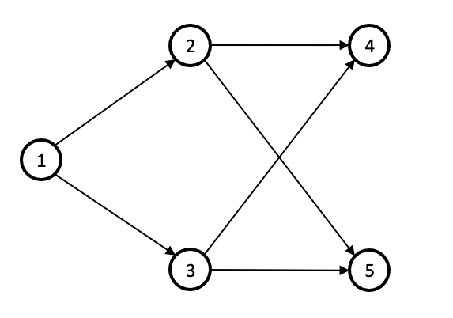

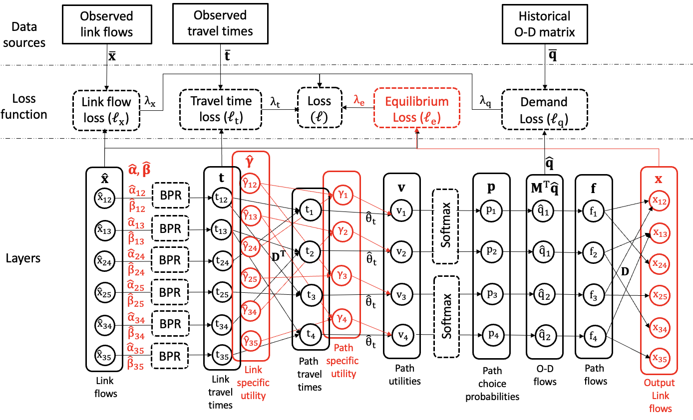

To understand the theory behind the algorithms and the use cases of this codebase, you can review the following resources:

+ Preprint: https://dx.doi.org/10.2139/ssrn.4490930
+ Journal article: http://dx.doi.org/10.1016/j.trc.2023.104409

Development Setup
=================

If using a Windows computer or a Macbook with Intel chip, you can use [<u>poetry</u>](https://python-poetry.org/) for python packaging and dependency management. The steps are:

1. Clone this repository.
2. [<u>Install</u>](<https://python-poetry.org/docs/#installation>)  the poetry cli.
3. Create a virtual environment: ``poetry shell``
4. Create .lock file with project dependencies: ``poetry lock``.
5. Install project dependencies: ``poetry install``.
6. Run the tests: `pytest`

<!-- .. _poetry: https://python-poetry.org/ -->

If using Linux or a Macbook with Apple Silicon chip, we recommend using Conda for python packaging and dependency management. The steps are:

1. Clone this repository.
2. Download and install Anaconda: https://docs.anaconda.com/anaconda/install/index.html
3. Create virtual environment: ``conda create -n pesuelogit``
4. Activate environment: ``conda activate pesuelogit``
5. Install dependencies: ``conda env update -f pesuelogit.yml``. If you are using linux, use ``pesuelogit-linux.yml`` instead.
6. Run the tests: `pytest`

This repository is currently compatible with Python 3.9.x

## Examples

The folder ``examples/notebooks`` contains Jupyter notebooks with code demonstrations that can be reproduced from your local environment. If you are using VS Code, please make sure to select the ``pesuelogit`` environment as your kernel to run each notebook.

## Visualizations

### Experiments

#### Model training

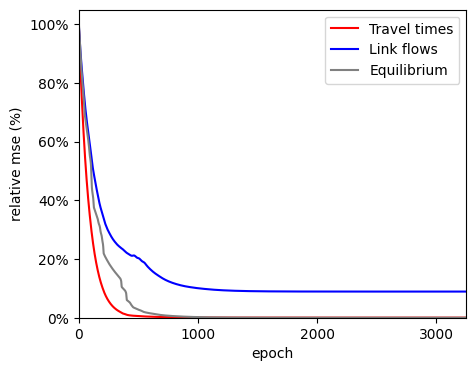 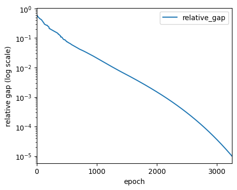 
<!--  -->

#### Origin-demand estimation

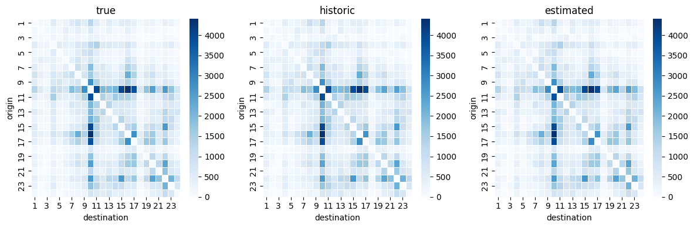

#### Parameter estimation

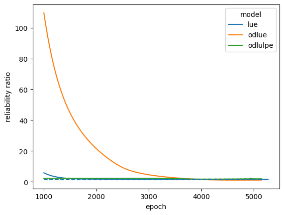 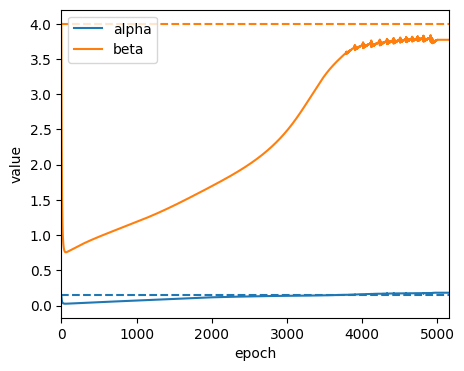 

### Large-scale deployment

#### Model training

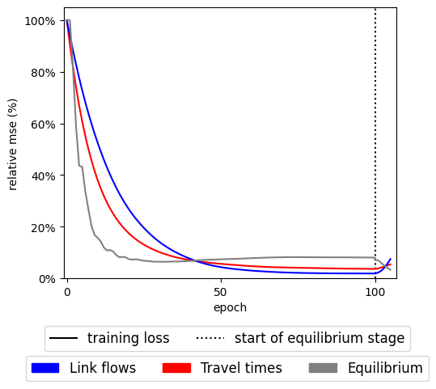 
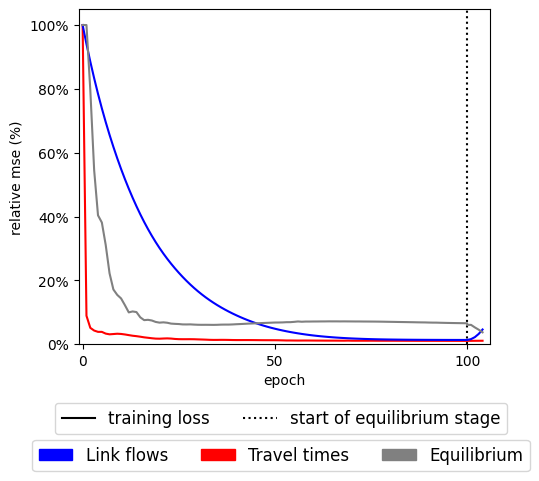 
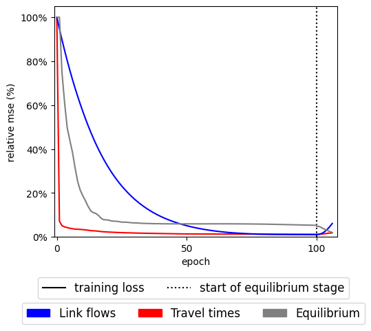

#### Parameter estimation

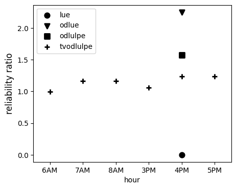 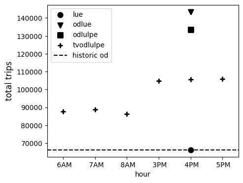 

Collaboration
=============

For any questions or interest in collaborating on this project, please open an issue in this repository. This package was developed under the guidance of Prof. Sean Qian. This codebase is being extended in the [MaTE](<https://github.com/pabloguarda/mate>) repository. 

🌟 Loved the Project? Give Us a Star!
=============

We are thrilled to see you here! If you find this codebase useful for your project or it has been a helpful resource, please consider giving it a star. 🌟 Your support means a lot and it also helps others discover this work.